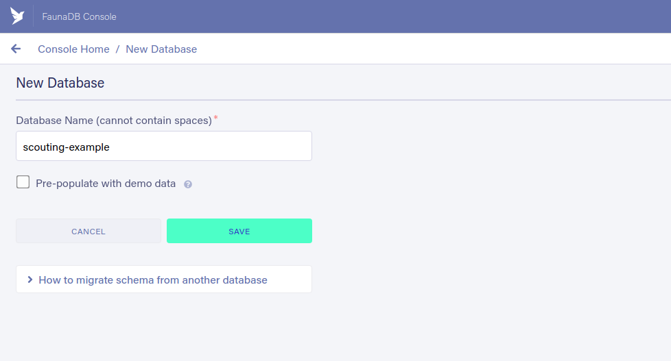

# Databases Proof of Concept

This repository uses easy-to-learn technologies to demonstrate basic database functionality, which could be used as supplement or alternative to Google Sheets in the future.

Live demo: https://www.scouting.gavintang.xyz/

## Local Setup

### Basic Environment

1. Clone repository
2. Install node packages

```
npm install
```

3. Optionally install netlify-cli globally

```
npm install -g netlify-cli
```

### Netlify

1. If you don't already have one, [create a Netlify account](https://app.netlify.com/signup)
2. Authorize Netlify CLI with your account

```
netlify login
```

3. In the root directory of the repository, use Netlify CLI to initialize a project

```
netlify init
```

4. Select from the options:
   > Create & configure a new site
5. Navigate through prompts. When prompted for
   > Your build command (hugo build/yarn run build/etc):

```
npm run build
```

### FaunaDB

1. [Create a FaunaDB account]("https://dashboard.fauna.com/accounts/register");
2. In the FaunaDB dashboard, create a new database
   
3. Create a new collection called matches
   
4. In the security tab, click "new key" to generate an API secret
   
5. Copy and save the generated API secret - it won't be displayed again
6. Open the Netlify dashboard

```
netlify open
```

7. Navigate to Deploys > Deploy settings > Environment > Environment variables
8. Add a new variable called FAUNADB_SERVER_SECRET
   

### Running the app

The site should be ready to run. Open the live link on the Netlify dashboard, or run

```
netlify dev
```

and navigate to http://localhost:8888/ to run locally

## Links to documentation for technologies used

[Netlify]("https://docs.netlify.com/")
[FauanaDB]("https://docs.fauna.com/")
[FaunaDB JS driver]("https://fauna.github.io/faunadb-js/index.html")
